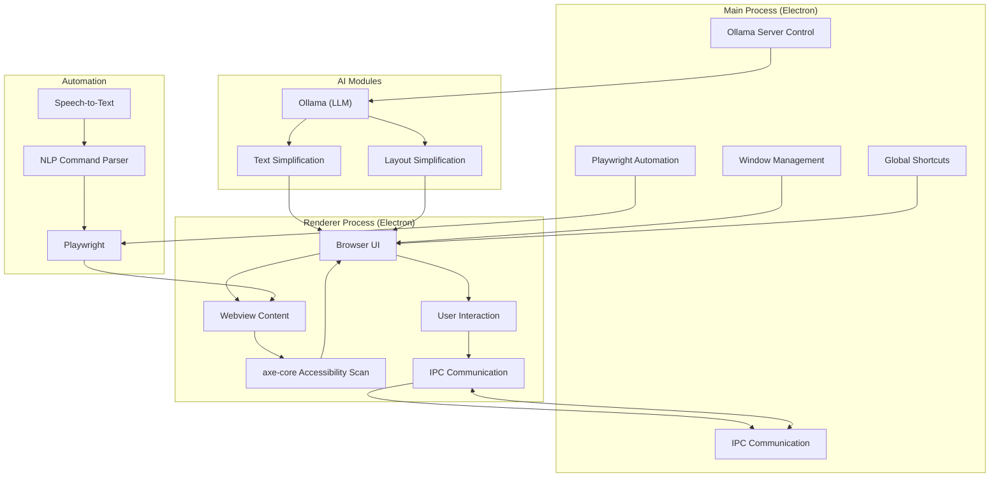

# Project Aura

# **Plan: Accessibility-Focused Web Browser**
This document outlines a comprehensive plan and user stories for creating a web browser with enhanced accessibility features. Built on the Electron framework, this browser will incorporate functionalities such as on-demand WCAG reports, AI-powered text and layout simplification, and voice and text-based navigation.
### **Core Technologies**
*   **Framework:** Electron
*   **Accessibility Auditing:** axe-core
*   **Text Simplification:** Ollama (with a suitable language model)
*   **Web Automation:** Playwright
*   **Speech-to-Text:** A suitable JavaScript library (to be evaluated for offline and accuracy capabilities)
*   **Command Parsing:** A JavaScript Natural Language Processing (NLP) library
### **Architectural Overview**
The application will consist of a main Electron process and renderer processes for each browser window.
*   **Main Process:** Will handle window management, global shortcuts, and background tasks like managing the Ollama server and Playwright instances.
*   **Renderer Process:** Will be responsible for displaying the web content, the browser's UI, and interacting with the user. It will also execute the `axe-core` scans and send text content to the main process for simplification. Communication between the main and renderer processes will be handled via Electron's IPC (Inter-Process Communication) modules.
### **Development Plan & User Stories**
The development will be broken down into the following epics and corresponding user stories:
---
### **Epic 1: Foundational Browser Infrastructure**
This epic covers the basic setup of the Electron application and core browsing functionalities.
*   **User Story 1.1:** As a user, I want to open the application and see a browser window with an address bar, back, forward, and refresh buttons, so that I can perform basic web navigation.
*   **User Story 1.2:** As a user, I want to be able to type a URL into the address bar and have the webpage load in the main view, so that I can visit different websites.
*   **User Story 1.3:** As a user, I want the application to be installable on my operating system (Windows, macOS, Linux), so that I can easily access and use the browser.
*   **User Story 1.4:** As a developer, I want to set up a robust build and packaging process for the Electron application to ensure cross-platform compatibility and ease of distribution.
---
### **Epic 2: WCAG Report Generation**
This epic focuses on integrating an accessibility auditing tool to provide on-demand WCAG reports.
*   **User Story 2.1:** As a user, I want a button or a menu option to generate a WCAG compliance report for the current webpage, so that I can understand its accessibility status.
*   **User Story 2.2:** As a user, when I generate a report, I want to see a clear and understandable summary of accessibility issues, categorized by severity (e.g., critical, serious, moderate).
*   **User Story 2.3:** As a user, I want to be able to view detailed information for each identified issue, including the WCAG success criterion it violates and a snippet of the problematic code, so that I or a developer can understand how to fix it.
*   **User Story 2.4:** As a developer, I want to integrate the `axe-core` library into the renderer process to perform the accessibility scan on the currently loaded webpage.
*   **User Story 2.5:** As a developer, I want to design an accessible and user-friendly interface to display the generated WCAG report, with options to filter and sort the issues.
---
### **Epic 3: AI-Powered Text Simplification**
This epic centers on using a local large language model (LLM) via Ollama to simplify complex web page text.
*   **User Story 3.1:** As a user, I want a button or a right-click context menu option to simplify the text of the entire webpage or a selected portion of it, so that I can better understand the content.
*   **User Story 3.2:** As a user, when I choose to simplify text, I want the simplified version to be displayed in a clear and readable format, such as an overlay, a side panel, or by replacing the original text in place.
*   **User Story 3.3:** As a developer, I want to integrate the `electron-ollama` package to manage the lifecycle of the Ollama server within the Electron application, ensuring a seamless user experience.
*   **User Story 3.4:** As a developer, I want to implement a mechanism to extract the text content from the current webpage's DOM.
*   **User Story 3.5:** As a developer, I want to create a robust prompting strategy for the Ollama model to effectively simplify the extracted text while preserving its meaning.
---
### **Epic 4: AI-Powered Layout Simplification**
This epic is focused on leveraging AI to re-render the webpage layout for improved readability and accessibility based on user preferences.
*   **User Story 4.1:** As a user, I want to be able to activate a "simplified layout" mode that removes distracting elements like ads, complex navigation bars, and non-essential sidebars.
*   **User Story 4.2:** As a user, I want to have basic preferences for the simplified layout, such as font size, line spacing, and color contrast, so that I can tailor the reading experience to my needs.
*   **User Story 4.3:** As a developer, I want to extract the semantic structure (headings, paragraphs, lists, images) of the current webpage.
*   **User Story 4.4:** As a developer, I want to use an LLM to analyze the extracted structure and generate a simplified CSS stylesheet that declutters the layout and applies user preferences.
*   **User Story 4.5:** As a developer, I want to inject the generated simplified CSS into the webpage to dynamically alter its appearance without a full page reload.
---
### **Epic 5: Vocal and Textual Navigation**
This epic will implement hands-free and keyboard-based navigation of web pages using Playwright for browser automation.
*   **User Story 5.1:** As a user, I want to be able to activate a voice command mode to navigate the webpage using spoken instructions.
*   **User Story 5.2:** As a user, I want to be able to speak commands like "scroll down," "click on the link with text 'About Us'," and "type 'assistive technology' in the search bar," and have the browser perform these actions.
*   **User Story 5.3:** As a user, I want a dedicated input field or a command palette to type in navigation commands as an alternative to voice input.
*   **User Story 5.4:** As a developer, I want to integrate a speech-to-text library into the Electron application to capture and transcribe user voice commands.
*   **User Story 5.5:** As a developer, I want to implement a command parser using an NLP library to understand the intent and parameters from the transcribed text or typed commands.
*   **User Story 5.6:** As a developer, I want to use Playwright's API to execute the parsed commands on the current webpage, such as clicking elements, typing text, and scrolling.
*   **User Story 5.7:** As a developer, I want to provide visual feedback to the user to confirm that their voice or text command has been understood and is being executed. 

---

## Installation & Running

1. **Install dependencies:**
   ```bash
   npm install
   ```

2. **Run the app:**
   ```bash
   npm start
   ```

3. **Build for distribution:**
   ```bash
   npm run build
   ```
   *(If you have a build script configured)*

---

## Architecture Overview

## Architecture Overview

